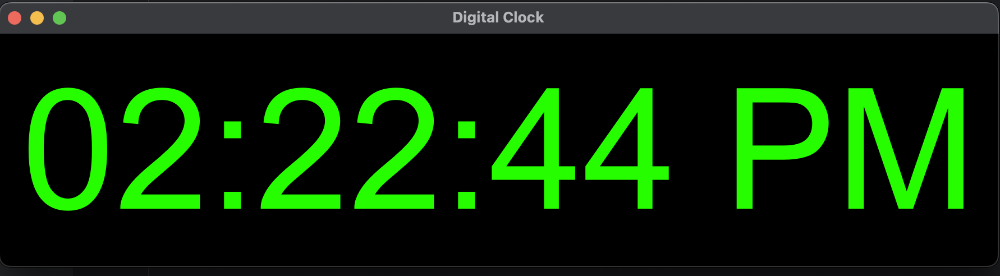

# 🕒 Python PyQt5 Digital Clock

A sleek digital clock application built with **Python** and **PyQt5**. This application features a minimalist design, real-time updates, and a visually appealing interface.

## 🚀 Features
- Displays the current time in `hh:mm:ss AP` format (e.g., `02:45:08 PM`).
- Automatically updates every second.
- Customizable UI:
  - Large, legible font.
  - Vibrant green text with a black background.

## 🛠️ Technologies Used
- **Python**: Core programming language.
- **PyQt5**: For building the graphical user interface (GUI).

## 📸 Screenshot


## 📋 Prerequisites
Before running the application, ensure you have the following installed:
- Python 3.7 or higher
- **PyQt5** library
  

Install PyQt5 using:
```bash
pip install pyqt5
```
## 🔧 Installation and Setup
Clone this repository to your local machine:

```bash
git clone https://github.com/ramoncaban/digital-clock.git
cd digital-clock
```

Run this application: 
```bash
python digital_clock.py
```


## 🚀 How It Works

1.	When the program starts, a window appears displaying the current time.
2.	The time is updated every second using a QTimer.
3.	The time is displayed in a visually appealing style:
   
	  •	Large green text (font-size: 150px) on a black background.
  	
	  •	Center-aligned for a clean look.

## 🔮 Future Enhancements

•	Add an alarm feature with custom sound notifications.

•	Provide options to change time format (e.g., 24-hour vs. 12-hour).

•	Allow users to customize font color, size, and background.

